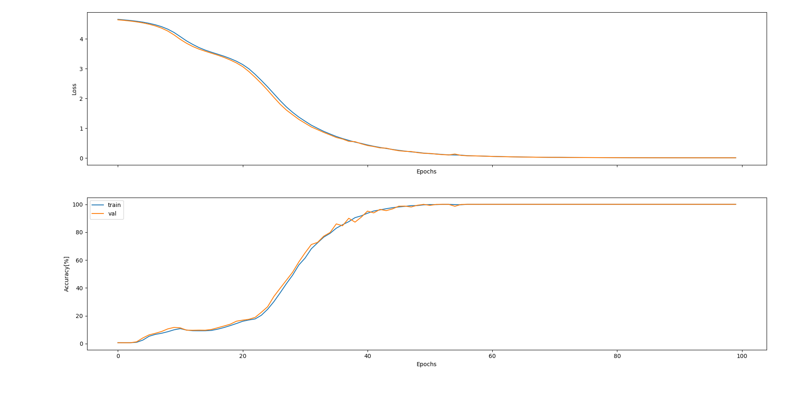
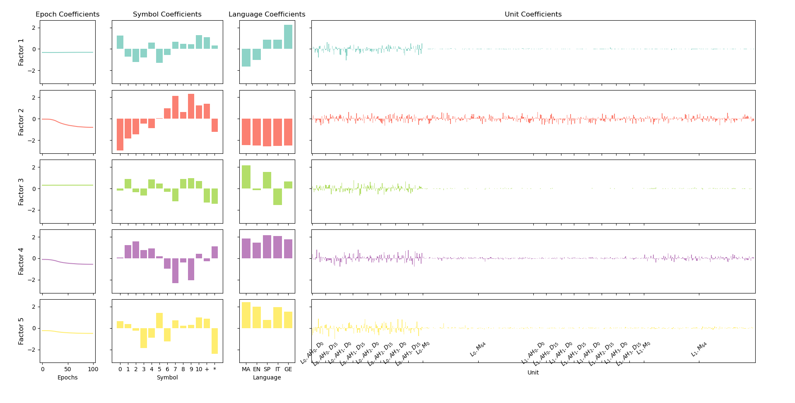

# LLM-Modularity
This repo was developed to study the emergence of functional modules in LLMs. The general approach consists of training a Hooked Transformer Model (TransformerLens library) to perform a task involving translation (from five languages: math, English, Spanish, Italian, and German) and mathematical operations (addition and multiplication). For example, the network should learn that "1 + two" equals "3" and that "dos times four" equals "8". Thus, to efficiently perform such a task, the network should develop the ability to perform translation and mathematical operations. Are these two functions implemented by different modules in the network?

To **train** the Hooked Transformer model on the "translate and operate" task run:
- ```cd ./Code```
- ```python ./train.py```

To compute the internal activations and run the 4-way **Canonical Polyadic decomposition Analysis** (CPD) run:
- ```cd ./Code```
- ```python ./analyse.py```

Note: most of the training and analysis parameters are specified in config files in the ```./Configs``` folder.

## Initial Results
### Training curves

### CPD

